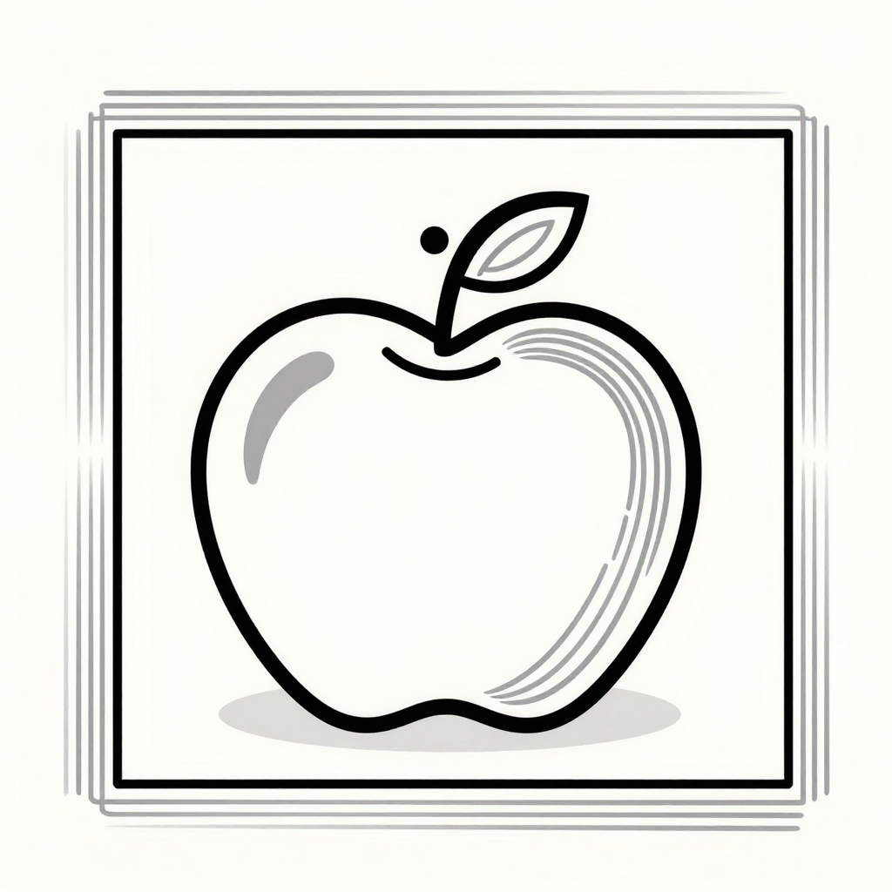

<div align="center">
  
  <h2>ImageMarker</h2>
  <h3>A Free Online Image Annotation Tool</h3>
</div>

### 1. Introduction

- ImageMarker is a **free online** image annotation tool that runs in the browser. No complicated installation is required—open the web page and start working.
- We strive to provide a truly cross-platform experience regardless of your operating system. It is especially suitable for small computer-vision and deep-learning projects, making dataset preparation simpler and faster.
- Completed annotations can be downloaded in multiple supported formats. The application is written in TypeScript and uses the React / Redux stack.

### 2. AI Integration

ImageMarker aims to significantly reduce the time spent annotating images. It integrates AI models that can provide suggestions and automate repetitive, tedious work:

- **YOLOv5**: the most capable integration. Through [yolov5js](https://github.com/SkalskiP/yolov5js), it can load both pretrained models and your own trained models exported in TensorFlow.js format.
- **SSD**: pretrained on the [COCO dataset](http://cocodataset.org), it helps draw bounding boxes and can suggest labels in some cases.
- **PoseNet**: a vision model that estimates the positions of key human joints and can be used to estimate a person's pose in an image or video.

The core engine behind the AI features is [TensorFlow.js](https://www.tensorflow.org/js). Running supported models in the browser can speed up annotation while protecting data privacy: images do not need to be sent to a server because the AI runs on your device.

### 3. Features

- **Annotation types**: rectangles, lines, points, polygons, and an image-classification (tag) mode.
- **Import and export formats**: YOLO, VOC XML, VGG JSON, COCO JSON, and CSV, subject to the support matrices below.
- **AI options**: load YOLOv5, SSD, or PoseNet models locally in the browser, or connect to a Roboflow inference server.
- **Keyboard shortcuts**: common editor actions can be performed from the keyboard to improve annotation efficiency.

### 4. Local Setup

```bash
# Clone the repository
git clone https://github.com/FasterEdge/ImageMarker.git

# Enter the project directory
cd ImageMarker

# Install dependencies
npm install

# Start on localhost:3000 with hot reload
npm start
```

> To run the application locally as documented, use npm `8.x.x` and Node.js `v16.x.x`.

The package also defines `npm run dev`, `npm run build`, `npm run preview`, `npm test`, `npm run test:coverage`, and `npm run lint` for development, production builds, previews, tests, coverage, and linting respectively.

### 5. Docker Deployment

```bash
# Build the Docker image
docker build -t imagemarker .

# Run the Docker image as a service
docker run -dit -p 3000:3000 --restart=always --name=imagemarker imagemarker

# View container logs
docker logs imagemarker

# Open the application: http://localhost:3000/
```

### 6. Keyboard Shortcuts

| Action | Context | macOS | Windows / Linux |
|:-------|:-------:|:-----:|:---------------:|
| Complete a polygon | Editor | <kbd>Enter</kbd> | <kbd>Enter</kbd> |
| Cancel polygon drawing | Editor | <kbd>Escape</kbd> | <kbd>Escape</kbd> |
| Delete the selected annotation | Editor | <kbd>Backspace</kbd> | <kbd>Delete</kbd> |
| Load the previous image | Editor | <kbd>⌥</kbd> + <kbd>Left</kbd> | <kbd>Ctrl</kbd> + <kbd>Left</kbd> |
| Load the next image | Editor | <kbd>⌥</kbd> + <kbd>Right</kbd> | <kbd>Ctrl</kbd> + <kbd>Right</kbd> |
| Zoom in | Editor | <kbd>⌥</kbd> + <kbd>+</kbd> | <kbd>Ctrl</kbd> + <kbd>+</kbd> |
| Zoom out | Editor | <kbd>⌥</kbd> + <kbd>-</kbd> | <kbd>Ctrl</kbd> + <kbd>-</kbd> |
| Move the image | Editor | <kbd>Up</kbd> / <kbd>Down</kbd> / <kbd>Left</kbd> / <kbd>Right</kbd> | <kbd>Up</kbd> / <kbd>Down</kbd> / <kbd>Left</kbd> / <kbd>Right</kbd> |
| Select a label | Editor | <kbd>⌥</kbd> + <kbd>0-9</kbd> | <kbd>Ctrl</kbd> + <kbd>0-9</kbd> |
| Close a dialog | Dialog | <kbd>Escape</kbd> | <kbd>Escape</kbd> |

### 7. Export Formats

| | CSV | YOLO | VOC XML | VGG JSON | COCO JSON |
|:--:|:---:|:----:|:-------:|:--------:|:---------:|
| **Point** | ✓ | ✗ | ☐ | ☐ | ☐ |
| **Line** | ✓ | ✗ | ✗ | ✗ | ✗ |
| **Rectangle** | ✓ | ✓ | ✓ | ☐ | ☐ |
| **Polygon** | ☐ | ✗ | ☐ | ✓ | ✓ |
| **Tag** | ✓ | ✗ | ✗ | ✗ | ✗ |

> ✓ indicates a supported format; ☐ indicates a format that is not yet supported; ✗ indicates that the format is not meaningful for the given annotation type.

### 8. Import Formats

| | CSV | YOLO | VOC XML | VGG JSON | COCO JSON |
|:--:|:---:|:----:|:-------:|:--------:|:---------:|
| **Point** | ☐ | ✗ | ☐ | ☐ | ☐ |
| **Line** | ☐ | ✗ | ✗ | ✗ | ✗ |
| **Rectangle** | ☐ | ✓ | ✓ | ☐ | ✓ |
| **Polygon** | ☐ | ✗ | ☐ | ☐ | ✓ |
| **Tag** | ☐ | ✗ | ✗ | ✗ | ✗ |

> ✓ indicates a supported format; ☐ indicates a format that is not yet supported; ✗ indicates that the format is not meaningful for the given annotation type.

### 9. Privacy

Images are not stored because they are not sent anywhere in the first place.

### 10. License

This project is licensed under GPL-3.0. See [LICENSE](./LICENSE) for details.
